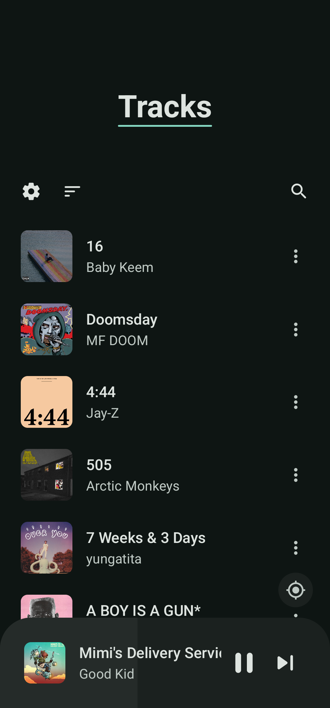
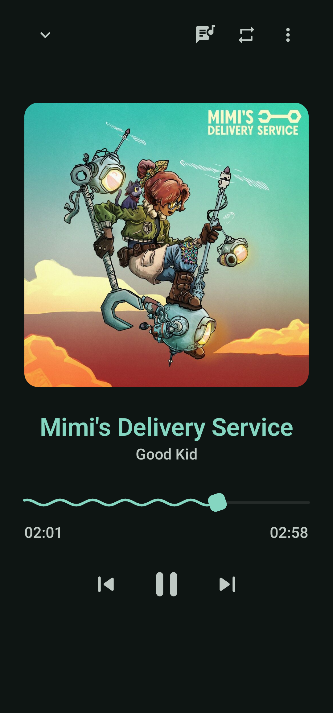
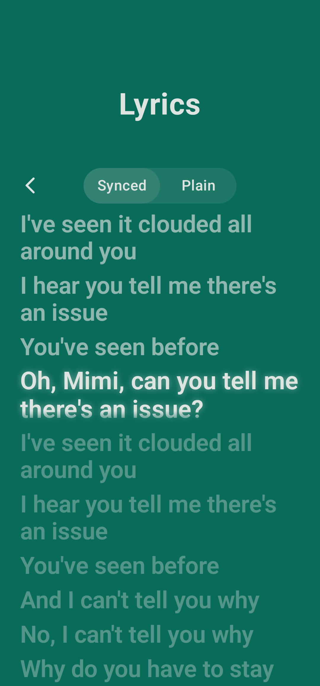
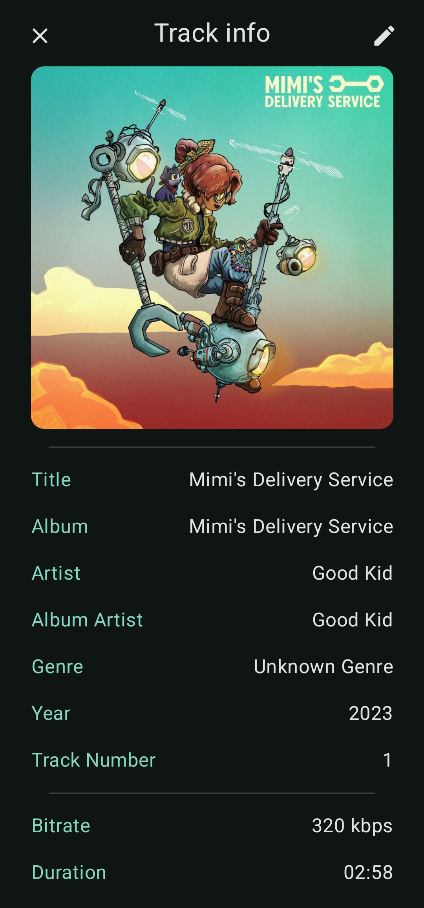
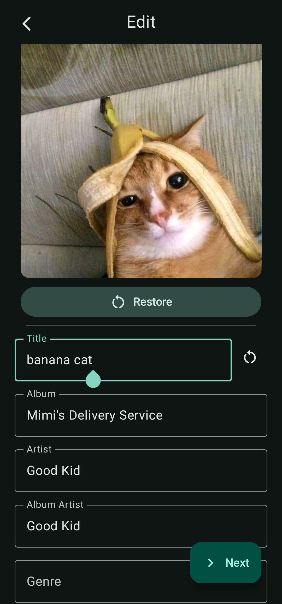
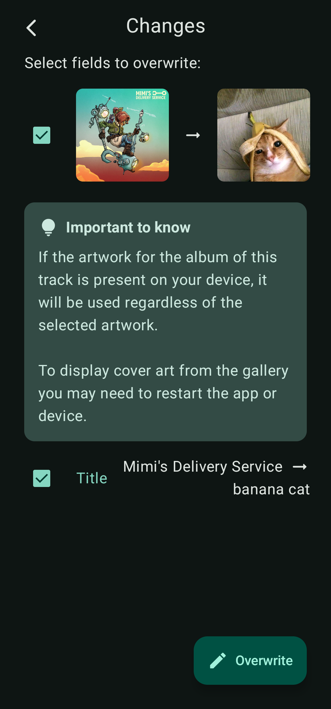
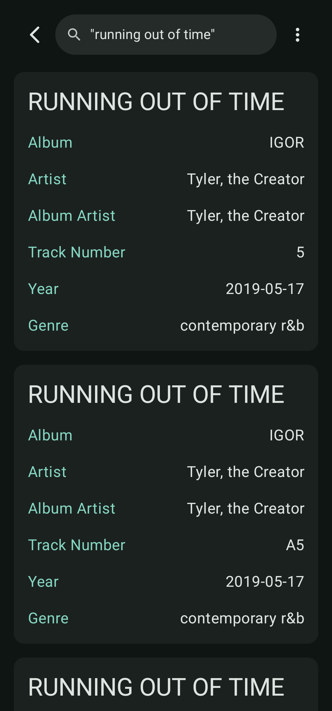

<div align="center">
  

# Lotus

### Music player for Android
  
</div>

## Screenshots

<div align="center">
  <div>
    
    
    
    
    
    
    
    
  </div>
</div>

## Features

- Lean fork to keep my personal use flow as smooth as possible.
- Enjoy your favorite music in a variety of formats, including MP3, FLAC, OGG, WAV, and more
- Easily browse tracks, albums, artists, and create custom playlists
- Designed with [Material You](https://m3.material.io/) and supports dynamic color palettes
- Supports AMOLED dark theme

## Build

```bash
./gradlew assembleDebug           # Build debug APK
./gradlew assembleRelease         # Build release APK
./gradlew clean                   # Clean build artifacts
adb install app/build/outputs/apk/debug/lotus-1.4.0-arm64-v8a-release.apk    # Install debug APK
adb install app/build/outputs/apk/release/lotus-1.4.0-arm64-v8a-debug.apk  # Install release APK

```

## Credits

Some UI elements are inspired by [Vanilla](https://github.com/vanilla-music/vanilla)

[Reorderable](https://github.com/Calvin-LL/Reorderable)

Most of this fork is built using AI assisted tools.

## License

Lotus is licensed under [GPLv3](LICENSE.md)
